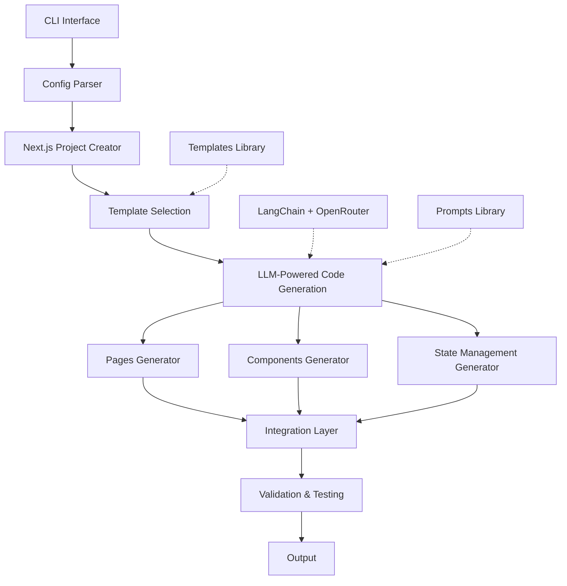

# Next.js & Tailwind Website Builder from NazareAI

[](https://www.python.org/downloads/)
[](LICENSE)
[](https://github.com/your-username/nextjs-builder)

An AI-powered module for building customized Next.js and Tailwind CSS websites using natural language descriptions. This tool leverages LangChain and OpenRouter with Claude-3.5-Sonnet to generate high-quality, production-ready code.

## 🌟 Features

- **Natural Language Input**: Describe your website and have it generated automatically
- **Next.js App Router**: Modern Next.js 14+ with App Router and TypeScript
- **Tailwind CSS**: Clean, responsive designs using core Tailwind (no component libraries)
- **Multiple Templates**: Support for general-purpose, blog, e-commerce, and portfolio websites
- **SSR by Default**: Server-side rendering for optimal SEO performance
- **React Context & Query**: State management with React Context API and React Query
- **Image Optimization**: Built-in Next.js Image component for optimized images
- **Optional Features**: Authentication and database integration as needed

## 📋 Prerequisites

- Python 3.9+
- Node.js 18.17.0+ and npm
- OpenRouter API key (for Claude-3.5-Sonnet access)

## 🚀 Quick Start

### Installation

```bash
# Clone the repository
git clone https://github.com/nazareai/nextjs-builder.git
cd nextjs-builder

# Install dependencies
pip install -r requirements.txt

# Set up environment variables
cp .env.example .env
# Edit .env to add your OpenRouter API key
```

### Basic Usage

```bash
# Generate a basic website
python test.py "Build a company website with a home page, about page, and contact form"

# Generate with a specific template
python test.py "Create a handmade jewelry store" --template=ecommerce

# Include authentication
python test.py "Build a travel blog with user comments" --template=blog --auth

# Specify database integration
python test.py "Create a photographer portfolio" --template=portfolio --db=mongodb
```

## 🏗️ Architecture

The Next.js & Tailwind Website Builder consists of several key components:



### Key Components

- **CLI Interface**: Command-line tool for interacting with the builder
- **Project Creator**: Sets up Next.js projects with the right configuration
- **Template System**: Manages different website templates
- **LLM Integration**: Connects with OpenRouter to access Claude-3.5-Sonnet
- **Code Generation**: Creates components, pages, and state management
- **Validation**: Ensures generated code meets quality standards

## 📊 Project Structure

```
nextjs-builder/
├── README.md                # This file
├── requirements.txt         # Python dependencies
├── setup.py                 # Package setup
├── test.py                  # CLI entry point
│
├── prompts/                 # LLM prompt templates
│   ├── system/              # System prompts
│   ├── components/          # Component generation prompts
│   ├── pages/               # Page generation prompts
│   └── templates/           # Website type templates
│
├── templates/               # Starting point templates
│   ├── base/                # Common components for all sites
│   ├── blog/                # Blog-specific components
│   ├── ecommerce/           # E-commerce components
│   └── portfolio/           # Portfolio components
│
└── src/                     # Module source code
    ├── cli.py               # CLI argument handling
    ├── config.py            # Configuration management
    ├── installer/           # Next.js project installation
    ├── generator/           # Code generation
    ├── llm/                 # LangChain integration
    ├── utils/               # Utility functions
    └── features/            # Optional feature integrations
```

## 🔧 Configuration

### Environment Variables

Create a `.env` file with the following variables:

```
OPENROUTER_API_KEY=your_api_key_here
OPENROUTER_BASE_URL=https://openrouter.ai/api/v1
```

### Configuration File

You can also create a `nextjs-builder.config.json` file for additional configuration:

```json
{
  "llm": {
    "model": "anthropic/claude-3.5-sonnet-20240620",
    "temperature": 0.7,
    "max_tokens": 10000
  },
  "templates": {
    "default": "general"
  },
  "validation": {
    "run_eslint": true,
    "run_typescript_check": true
  }
}
```

## 📝 CLI Options

| Option      | Description                                   | Default   |
|-------------|-----------------------------------------------|-----------|
| description | Description of the website to build           | (required)|
| --template  | Website template (general, blog, ecommerce, portfolio) | "general" |
| --auth      | Include authentication                        | false     |
| --db        | Database integration (none, mongodb, postgres, supabase) | "none" |
| --output    | Output directory for the generated website    | "./website"|
| --verbose   | Enable verbose logging                        | false     |

## 🧩 Templates

### General Website Template

A multi-purpose website suitable for businesses, organizations, or personal sites.

**Key Features:**
- Home page with hero section
- About page with team profiles
- Services or features showcase
- Contact form with validation
- Responsive navigation and footer

### Blog Template

A content-focused blog website optimized for readability and SEO.

**Key Features:**
- Featured posts and categories
- Blog listing with filtering
- Individual post pages with author info
- Category and tag archives
- Search functionality

### E-commerce Template

A complete online store with product showcase and checkout flow.

**Key Features:**
- Product listings with filtering
- Product detail pages with gallery
- Shopping cart functionality
- Checkout process
- Order history

### Portfolio Template

A showcase website for creative professionals and their work.

**Key Features:**
- Work/project showcase
- Project detail pages
- About/bio section
- Skills and experience presentation
- Contact form

## 🔌 Optional Features

### Authentication

When enabled with `--auth`, the module will add:

- User registration and login forms
- Protected routes
- User profile management
- Session handling

### Database Integration

Available options with `--db`:

- **mongodb**: Sets up MongoDB connection with proper models
- **postgres**: Integrates PostgreSQL with Prisma ORM
- **supabase**: Connects to Supabase for database and auth

## 🧪 Testing

Run the test suite to validate the module:

```bash
# Run all tests
pytest

# Run specific test categories
pytest tests/unit/
pytest tests/integration/
pytest tests/e2e/
```

## 📘 Documentation

For more detailed documentation, see:

- [Architecture Plan](./nextjs-builder-plan.md)
- [Implementation Guide](./nextjs-builder-implementation.md)
- [Prompts Structure](./nextjs-builder-prompts.md)
- [API Design](./nextjs-builder-api-design.md)
- [Development Roadmap](./nextjs-builder-roadmap.md)
- [Testing Strategy](./nextjs-builder-testing.md)

## 🚧 Development Status

This project is currently in **alpha** status. Core functionality is being finalized and the API may change.

### Current Version: 0.1.0

- ✅ Basic CLI interface
- ✅ Next.js project creation
- ✅ LangChain integration
- ✅ Basic template system
- ✅ Component generation
- ✅ Page generation
- 🔄 State management implementation
- 🔄 Optional features

## 🤝 Contributing

Contributions are welcome! Please see [CONTRIBUTING.md](CONTRIBUTING.md) for guidelines.

### Development Setup

```bash
# Clone the repository
git clone https://github.com/nazareai/nextjs-builder.git
cd nextjs-builder

# Install dependencies
pip install -e ".[dev]"

# Set up pre-commit hooks
pre-commit install
```

## 📄 License

This project is licensed under the MIT License - see the [LICENSE](LICENSE) file for details.

## 👏 Acknowledgments

- [Next.js](https://nextjs.org/) - The React framework
- [Tailwind CSS](https://tailwindcss.com/) - A utility-first CSS framework
- [LangChain](https://langchain.com/) - Framework for LLM applications
- [OpenRouter](https://openrouter.ai/) - LLM API router
- [Anthropic Claude-3.5-Sonnet](https://www.anthropic.com/) - The LLM powering code generation