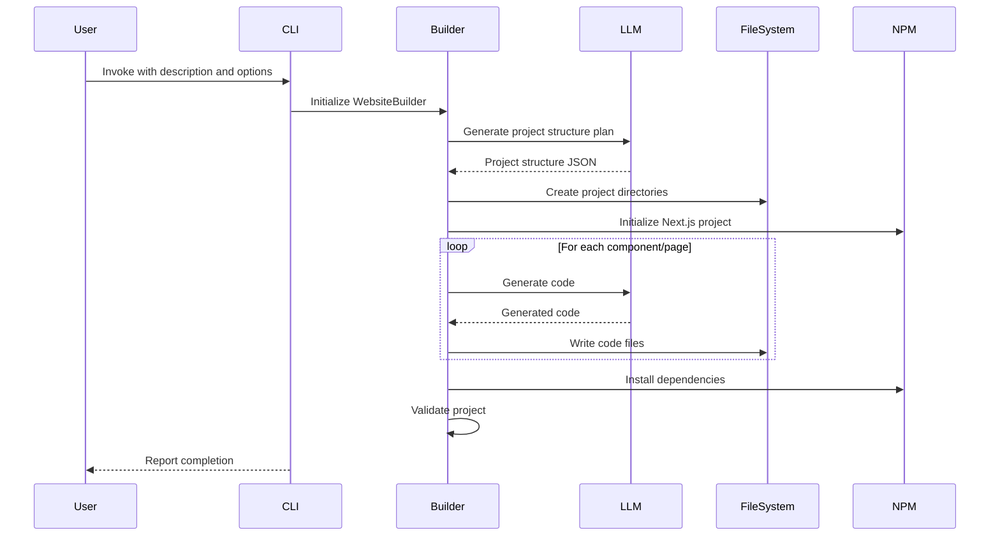

# Next.js & Tailwind Website Builder - API Design

This document outlines the API design and integration patterns for the Next.js and Tailwind website builder module.

## Core API Components

### CLI Interface

The CLI provides the main entry point for end users and accepts the following parameters:

```bash
python test.py "build website description" [options]
```

**Parameters:**

| Parameter    | Type           | Description                                   | Default   |
|--------------|----------------|-----------------------------------------------|-----------|
| description  | string         | Description of the website to build           | (required)|
| --template   | string         | Website template type                         | "general" |
| --auth       | flag           | Include authentication                        | false     |
| --db         | string         | Database integration type                     | "none"    |
| --output     | string         | Output directory for the generated website    | "./website"|
| --verbose    | flag           | Enable verbose logging                        | false     |

### Module API

For programmatic usage, the module exposes a Python API:

```python
from nextjs_builder import WebsiteBuilder

builder = WebsiteBuilder(
    description="Company website with contact form",
    template="general",
    auth=False,
    database=None,
    output_dir="./website"
)

# Generate the website
builder.generate()

# Validate the generated code
validation_result = builder.validate()

# Run development server
builder.run_dev_server()
```

## Data Flow Architecture

The data flows through the system as follows:



## Key Interfaces

### `WebsiteBuilder` Class

The main class orchestrating the website generation process.

```python
class WebsiteBuilder:
    def __init__(
        self,
        description: str,
        template: str = "general",
        auth: bool = False,
        database: Optional[str] = None,
        output_dir: str = "./website",
        verbose: bool = False,
    ):
        """
        Initialize the website builder.
        
        Args:
            description: Description of the website to build
            template: Website template to use (general, blog, ecommerce, portfolio)
            auth: Whether to include authentication
            database: Database to integrate (none, mongodb, postgres, supabase)
            output_dir: Output directory for the generated website
            verbose: Whether to enable verbose logging
        """
        pass
        
    def generate(self) -> bool:
        """
        Generate the website based on the provided description and options.
        
        Returns:
            True if the website was generated successfully, False otherwise.
        """
        pass
        
    def validate(self) -> Dict[str, Any]:
        """
        Validate the generated website.
        
        Returns:
            A dictionary containing validation results.
        """
        pass
        
    def run_dev_server(self) -> subprocess.Popen:
        """
        Run the development server for the generated website.
        
        Returns:
            A subprocess.Popen object representing the running server.
        """
        pass
```

### `TemplateManager` Class

Manages the website templates and their customization.

```python
class TemplateManager:
    def __init__(self, template_name: str):
        """
        Initialize the template manager.
        
        Args:
            template_name: The name of the template to use
        """
        pass
        
    def get_project_structure(self) -> Dict[str, Any]:
        """
        Get the project structure for the selected template.
        
        Returns:
            A dictionary representing the project structure.
        """
        pass
        
    def get_component_list(self) -> List[str]:
        """
        Get the list of components to generate for the selected template.
        
        Returns:
            A list of component names.
        """
        pass
        
    def get_page_list(self) -> List[str]:
        """
        Get the list of pages to generate for the selected template.
        
        Returns:
            A list of page names.
        """
        pass
        
    def customize_template(self, description: str) -> Dict[str, Any]:
        """
        Customize the template based on the description.
        
        Args:
            description: The website description
            
        Returns:
            A dictionary containing customization options.
        """
        pass
```

### `CodeGenerator` Class

Handles the generation of code using LangChain and OpenRouter.

```python
class CodeGenerator:
    def __init__(self, llm_model: str = "anthropic/claude-3.5-sonnet-20240620"):
        """
        Initialize the code generator.
        
        Args:
            llm_model: The LLM model to use
        """
        pass
        
    def generate_component(
        self, 
        component_name: str, 
        requirements: Dict[str, Any]
    ) -> str:
        """
        Generate a component based on the requirements.
        
        Args:
            component_name: The name of the component to generate
            requirements: The component requirements
            
        Returns:
            The generated component code.
        """
        pass
        
    def generate_page(
        self, 
        page_name: str, 
        requirements: Dict[str, Any]
    ) -> str:
        """
        Generate a page based on the requirements.
        
        Args:
            page_name: The name of the page to generate
            requirements: The page requirements
            
        Returns:
            The generated page code.
        """
        pass
        
    def generate_state_management(
        self, 
        state_type: str, 
        requirements: Dict[str, Any]
    ) -> Dict[str, str]:
        """
        Generate state management code based on the requirements.
        
        Args:
            state_type: The type of state management to generate
            requirements: The state management requirements
            
        Returns:
            A dictionary mapping file names to generated code.
        """
        pass
```

### `ProjectInstaller` Class

Handles the installation and setup of the Next.js project.

```python
class ProjectInstaller:
    def __init__(self, output_dir: str):
        """
        Initialize the project installer.
        
        Args:
            output_dir: The output directory for the project
        """
        pass
        
    def create_nextjs_project(self) -> bool:
        """
        Create a new Next.js project.
        
        Returns:
            True if the project was created successfully, False otherwise.
        """
        pass
        
    def install_dependencies(
        self, 
        dependencies: List[str], 
        dev: bool = False
    ) -> bool:
        """
        Install dependencies in the project.
        
        Args:
            dependencies: List of dependencies to install
            dev: Whether to install as dev dependencies
            
        Returns:
            True if the dependencies were installed successfully, False otherwise.
        """
        pass
        
    def setup_project_structure(
        self, 
        structure: Dict[str, Any]
    ) -> bool:
        """
        Set up the project structure.
        
        Args:
            structure: A dictionary representing the project structure
            
        Returns:
            True if the structure was set up successfully, False otherwise.
        """
        pass
```

## Extension Points

The module provides the following extension points for customization:

### 1. Custom Templates

You can create custom templates by adding new template definitions:

```python
from nextjs_builder.templates import register_template

# Define a custom template
custom_template = {
    "name": "my_custom_template",
    "description": "A custom website template",
    "components": ["Header", "Footer", "CustomHero", ...],
    "pages": ["Home", "About", "CustomPage", ...],
    "base_structure": {...},
}

# Register the template
register_template(custom_template)
```

### 2. Custom Component Generators

You can create custom component generators by implementing the `ComponentGenerator` interface:

```python
from nextjs_builder.generators import ComponentGenerator, register_component_generator

class CustomComponentGenerator(ComponentGenerator):
    def __init__(self):
        """Initialize the custom component generator."""
        pass
        
    def generate(self, name: str, requirements: Dict[str, Any]) -> str:
        """
        Generate a component based on the requirements.
        
        Args:
            name: The name of the component to generate
            requirements: The component requirements
            
        Returns:
            The generated component code.
        """
        # Custom generation logic
        return f"// Custom component: {name}\n..."

# Register the custom component generator
register_component_generator("custom_component", CustomComponentGenerator())
```

### 3. Custom LLM Providers

You can integrate custom LLM providers by implementing the `LLMProvider` interface:

```python
from nextjs_builder.llm import LLMProvider, register_llm_provider

class CustomLLMProvider(LLMProvider):
    def __init__(self, api_key: str):
        """
        Initialize the custom LLM provider.
        
        Args:
            api_key: API key for the LLM provider
        """
        self.api_key = api_key
        
    def generate_text(self, prompt: str) -> str:
        """
        Generate text based on the prompt.
        
        Args:
            prompt: The prompt to generate text from
            
        Returns:
            The generated text.
        """
        # Custom generation logic
        return "Generated text from custom LLM provider"

# Register the custom LLM provider
register_llm_provider("custom_provider", CustomLLMProvider("your-api-key"))
```

## Integration with LangChain and OpenRouter

The module integrates with LangChain and OpenRouter through the `LLMIntegration` class:

```python
from nextjs_builder.llm import LLMIntegration

# Initialize the LLM integration
llm_integration = LLMIntegration(
    model="anthropic/claude-3.5-sonnet-20240620",
    api_key=os.getenv("OPENROUTER_API_KEY"),
    base_url=os.getenv("OPENROUTER_BASE_URL", "https://openrouter.ai/api/v1")
)

# Generate text
response = llm_integration.generate_text(
    prompt="Create a React component that...",
    temperature=0.7,
    max_tokens=2000
)

print(response)
```

## Error Handling

The module includes comprehensive error handling:

1. **LLM Errors**: Handled through retry mechanisms and fallbacks
2. **Installation Errors**: Detailed error messages with suggested fixes
3. **Validation Errors**: Code validation results with specific issues identified
4. **Environment Errors**: Checks for missing dependencies or environment variables

Example error handling:

```python
try:
    builder = WebsiteBuilder(...)
    builder.generate()
except nextjs_builder.exceptions.LLMError as e:
    print(f"Error generating code: {e}")
    print(f"Retrying with alternative model...")
    builder.retry_with_alternative_model()
except nextjs_builder.exceptions.InstallationError as e:
    print(f"Error installing Next.js: {e}")
    print(f"Please install Node.js and npm before running this tool.")
except nextjs_builder.exceptions.ValidationError as e:
    print(f"Error validating generated code: {e}")
    print(f"Issues found: {e.issues}")
    builder.fix_validation_issues(e.issues)
```

## Configuration

The module can be configured using a configuration file or environment variables:

### Configuration File (nextjs-builder.config.json)

```json
{
  "llm": {
    "model": "anthropic/claude-3.5-sonnet-20240620",
    "temperature": 0.7,
    "max_tokens": 2000,
    "retry_attempts": 3
  },
  "templates": {
    "default": "general",
    "custom_templates_dir": "./custom-templates"
  },
  "installation": {
    "node_version": ">=14.0.0",
    "npm_version": ">=7.0.0",
    "default_dependencies": [
      "@tanstack/react-query",
      "next",
      "react",
      "react-dom"
    ]
  },
  "validation": {
    "run_eslint": true,
    "run_typescript_check": true
  }
}
```

### Environment Variables

```
OPENROUTER_API_KEY=your-api-key
OPENROUTER_BASE_URL=https://openrouter.ai/api/v1
NEXTJS_BUILDER_DEFAULT_TEMPLATE=general
NEXTJS_BUILDER_VERBOSE=true
NEXTJS_BUILDER_OUTPUT_DIR=./website
```

## Testing Strategy

The module includes comprehensive testing:

1. **Unit Tests**: Test individual components and functions
2. **Integration Tests**: Test the integration between components
3. **End-to-End Tests**: Test the complete website generation process
4. **Validation Tests**: Ensure generated code meets quality standards

Example test case:

```python
def test_generate_component():
    """Test component generation."""
    # Initialize the code generator
    generator = CodeGenerator()
    
    # Generate a component
    component = generator.generate_component(
        "Button",
        {
            "variant": "primary",
            "size": "medium",
            "with_icon": True
        }
    )
    
    # Assert the component contains the expected features
    assert "interface ButtonProps" in component
    assert "variant?: 'primary'" in component
    assert "size?: 'medium'" in component
    assert "icon?" in component
```

## Conclusion

This API design provides a comprehensive framework for the Next.js and Tailwind website builder module. The modular architecture allows for easy extension and customization, while the integration with LangChain and OpenRouter enables powerful code generation capabilities.

When implementing the module, follow these key principles:

1. **Modularity**: Keep components focused and single-purpose
2. **Extensibility**: Allow for easy customization and extension
3. **Robustness**: Include comprehensive error handling and validation
4. **Documentation**: Provide clear documentation and examples