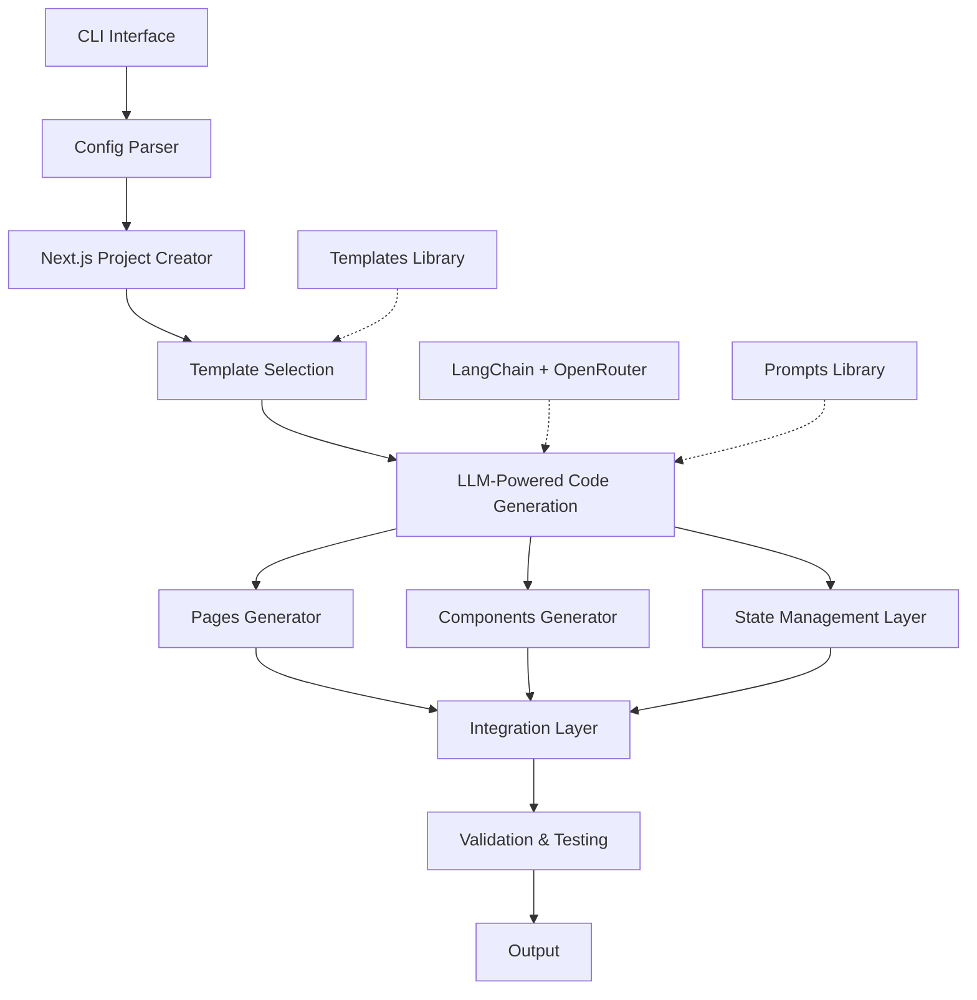

# Next.js & Tailwind Website Builder Module - Detailed Plan

## Overview

The module will create Next.js websites with Tailwind CSS using LangChain and OpenRouter with Claude-3.5-Sonnet. It will:

- Install Next.js via `npx create-next-app@latest` with specified parameters
- Create general-purpose websites with template options (e-commerce, blog, portfolio)
- Use core Tailwind CSS only (no external component libraries)
- Use React's Context API and React Query for state management
- Implement SSR by default for better SEO
- Include Next.js Image component for optimization
- Make authentication and database integration optional

## Architecture



## Project Structure

```
nextjs-builder/
├── README.md
├── requirements.txt
├── setup.py
├── test.py                   # Main CLI entry point
│
├── prompts/                  # LLM prompt templates
│   ├── __init__.py
│   ├── system/               # System prompts
│   │   ├── base_prompt.py    # Base system instructions
│   │   ├── next_best_practices.py
│   │   └── tailwind_guidelines.py
│   ├── components/           # Component generation prompts
│   │   ├── layout.py
│   │   ├── navigation.py
│   │   └── ui_elements.py
│   ├── pages/                # Page generation prompts
│   │   ├── listing_page.py
│   │   ├── detail_page.py
│   │   └── form_page.py
│   └── templates/            # Website type templates
│       ├── blog.py
│       ├── ecommerce.py
│       └── portfolio.py
│
├── templates/                # Starting point templates
│   ├── base/                 # Common components for all sites
│   ├── blog/                 # Blog-specific components
│   ├── ecommerce/            # E-commerce components
│   └── portfolio/            # Portfolio components
│
└── src/                      # Module source code
    ├── __init__.py
    ├── cli.py                # CLI argument handling
    ├── config.py             # Configuration management
    │
    ├── installer/
    │   ├── __init__.py
    │   └── nextjs_installer.py  # Next.js project creation
    │
    ├── generator/
    │   ├── __init__.py
    │   ├── project_structure.py # Generate project structure
    │   ├── pages_generator.py   # Generate pages
    │   ├── components_generator.py  # Generate components
    │   └── state_generator.py   # Generate state management
    │
    ├── llm/
    │   ├── __init__.py
    │   ├── langchain_setup.py   # LangChain configuration
    │   ├── openrouter_client.py # OpenRouter integration
    │   └── prompt_manager.py    # Prompt management
    │
    ├── utils/
    │   ├── __init__.py
    │   ├── file_operations.py   # File I/O helpers
    │   ├── validation.py        # Code validation utilities
    │   └── error_handler.py     # Error handling & self-fixing
    │
    └── features/             # Optional feature integrations
        ├── __init__.py
        ├── authentication/   # Authentication options
        │   ├── next_auth.py
        │   └── clerk.py
        └── database/         # Database integrations
            ├── mongodb.py
            ├── postgres.py
            └── supabase.py
```

## Implementation Plan

### 1. Module Foundation (Core Structure)

1. Create the basic directory structure for the module
2. Set up `setup.py` and `requirements.txt` with:
   - LangChain
   - OpenRouter SDK
   - Other necessary dependencies
3. Create the main CLI entry point (`test.py`)
4. Implement basic configuration parsing

### 2. Next.js Project Installation

1. Create the `nextjs_installer.py` to handle project creation with:
   ```
   npx create-next-app@latest <project-name> --typescript --eslint --tailwind --app --no-src-dir --no-import-alias
   ```
2. Implement post-installation setup:
   - Add React Query
   - Configure Tailwind extensions
   - Set up base directory structure

### 3. LLM Integration Setup

1. Configure LangChain and OpenRouter connection
2. Create the base system prompt
3. Create modular prompts for different aspects of the website:
   - Page layouts and templates
   - Component design
   - Data fetching patterns for SSR

### 4. Template System

1. Create base templates for:
   - General-purpose websites
   - E-commerce sites
   - Blog sites
   - Portfolio sites
2. Design template selection logic based on CLI parameters

### 5. Code Generation System

1. Create component generation system:
   - Layout components (header, footer, etc.)
   - UI components (buttons, cards, forms, etc.)
   - Navigation components

2. Create page generation system with SSR patterns:
   - Home page
   - Listing pages
   - Detail pages
   - Form pages

3. Implement state management generation:
   - Context API setup
   - React Query integration for data fetching

4. Implement core features:
   - Image optimization using Next.js Image component
   - Responsive design with Tailwind

### 6. Optional Features Integration

1. Create authentication options:
   - NextAuth.js integration
   - Email/password authentication
   - Social login options

2. Create database integration options:
   - MongoDB setup
   - PostgreSQL setup
   - Supabase integration

### 7. Validation & Self-Healing

1. Implement code validation to ensure generated code works
2. Create self-healing capabilities to fix common issues
3. Add test running functionality

### 8. CLI Interface Refinement

1. Enhance CLI with rich options:
   ```
   python test.py "build website XYZ" --template=ecommerce --auth --db=postgres
   ```
2. Add interactive mode for guided website creation
3. Implement progress reporting

## Prompt Structure

### System Base Prompt

The system prompt will follow a structure similar to what we observed in the Bolt system:

```python
SYSTEM_PROMPT = """
You are a Next.js and Tailwind CSS expert who creates high-quality, production-ready website code. You follow these principles:

1. Code Structure:
   - Use clean, modular component architecture
   - Follow Next.js App Router best practices
   - Implement SSR data fetching patterns for optimal performance
   - Use TypeScript with proper typing

2. Styling:
   - Use core Tailwind CSS exclusively (no component libraries)
   - Create responsive designs that work across all devices
   - Follow accessibility best practices
   - Maintain consistent styling patterns

3. State Management:
   - Use React Context API for app-wide state
   - Implement React Query for data fetching and server state
   - Create custom hooks for reusable logic
   - Keep components focused and single-purpose

Your task is to generate code for a website based on the user's requirements.
"""
```

### Component Generation Prompts

Specific prompts for generating different components, for example:

```python
COMPONENT_PROMPT = """
Create a [component_type] component with the following requirements:
- Purpose: [purpose]
- Props: [props]
- Functionality: [functionality]
- Styling: Use Tailwind CSS for styling

The component should be responsive, accessible, and follow these guidelines:
[guidelines]
"""
```

### SSR Data Fetching Pattern Prompts

```python
SSR_DATA_FETCH_PROMPT = """
Create a Next.js page with SSR data fetching for [page_purpose].
The page should:
- Fetch data server-side for SEO benefits
- Handle loading and error states
- Be fully typed with TypeScript
- Use the Next.js App Router pattern

Follow these data fetching patterns:
[patterns]
"""
```

## CLI Usage Examples

```bash
# Basic website with default options
python test.py "build a company website with home, about, and contact pages"

# E-commerce site with authentication
python test.py "build an e-commerce store selling handmade jewelry" --template=ecommerce --auth

# Blog with database integration
python test.py "build a travel blog with categories and comments" --template=blog --db=mongodb

# Portfolio with custom features
python test.py "build a photographer portfolio with image gallery" --template=portfolio